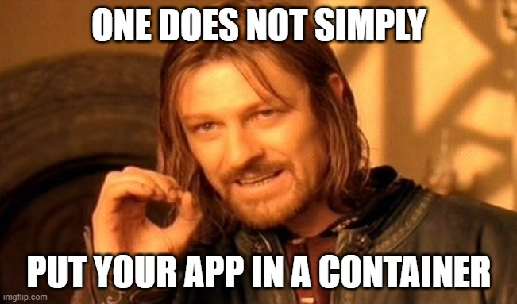
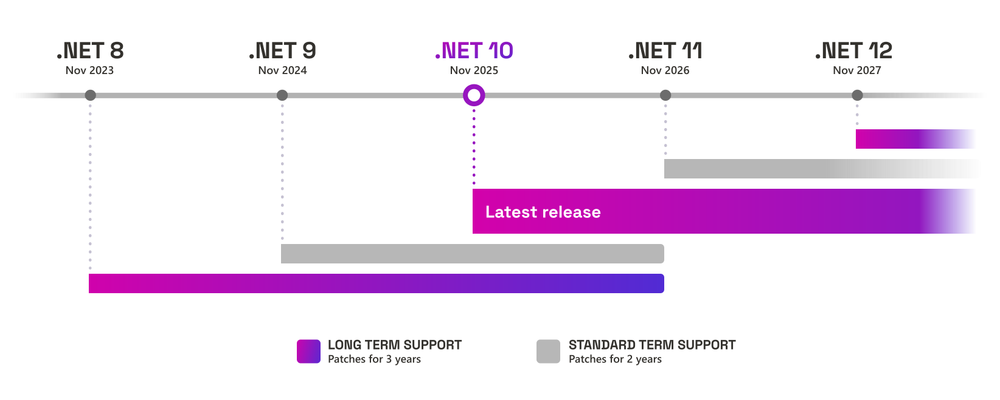

# <!--fit-->.NET In a Box <i class="fas fa-box"></i>

## <!--fit-->Containerizing <br/>.NET Applications
## Chris Ayers


---


## Chris Ayers

### Senior Risk SRE<br>Azure CXP AzRel<br>Microsoft

<i class="fa-brands fa-bluesky"></i> BlueSky: [@chris-ayers.com](https://bsky.app/profile/chris-ayers.com)
<i class="fa-brands fa-linkedin"></i> LinkedIn: - [chris\-l\-ayers](https://linkedin.com/in/chris-l-ayers/)
<i class="fa fa-window-maximize"></i> Blog: [https://chris-ayers\.com/](https://chris-ayers.com/)
<i class="fa-brands fa-github"></i> GitHub: [Codebytes](https://github.com/codebytes)
<i class="fa-brands fa-mastodon"></i> Mastodon: @Chrisayers@hachyderm.io
~~<i class="fa-brands fa-twitter"></i> Twitter: @Chris_L_Ayers~~


---

# Containerization

---

# Containers vs. Virtual Machines (VMs)

<div class="columns">

<div>

Virtual Machines (VMs)

 
- Larger images (GBs)          
- Slow (OS needs full init)    
- Superior isolation           
- Higher resource use          


</div>

<div>

Container                            
  
- Lightweight images (MBs)             
- Fast (seconds to start)              
- Shared OS can pose security concerns 
- Efficient resource utilization       

</div>


</div>

---

# Open Container Initiative (OCI)


Linux Foundation project that defines neutral specs everyone can implement.
- Three specs keep the ecosystem interoperable:
  - **Runtime**: How a container is executed on a host.
  - **Image**: How layers/metadata are packaged.
  - **Distribution**: How registries push/pull content.


---

# Container Runtimes

<div class="columns23">
<div>

Runtimes pull images, create containers, and enforce isolation:

- **High-level (Docker, Podman)** provide CLI UX, build, and orchestration glue.
- **Low-level (containerd, CRI-O, runc)** focus on OCI runtime compliance and performance.
- Feed higher-level orchestrators (AKS, Kubernetes, ACA) which handle scheduling, scaling, and networking.

</div>
<div class="center">

<br/>
<br/>


</div>
</div>

---

# Container Images

<div class="columns">

<div>

Container images implement the OCI image spec and bundle app code + runtime:
- **Immutable layers** guarantee consistent deployments.
- **Layer reuse** minimizes storage and accelerates pulls.
- **Metadata** (labels, env vars, exposed ports) guides orchestrators.
- These artifacts are what we tag and push to registries.

</div>
<div>


</div>
</div>

---

# Exploring Image Layers

- Layered filesystems only download what changed between builds.
- Smaller diffs → faster CI/CD, cheaper registry storage, quicker rollbacks.
- Registries deduplicate shared layers, and runtimes cache them locally for instant startup.


---


# Image Tags: Stable vs Unique

<div class="columns">
<div>

## Stable Tags

- Treat as moving targets for CI builds or dev stacks.
- Avoid promoting to prod because they silently shift.
- Examples: `latest`, `stable`, `v1.0`, `production`.
- Live in registries and are referenced by orchestrator manifests—drift here cascades through environments.

</div>
<div>

## Unique Tags

- Immutable references for a single build or artifact.
- Ideal for releases, rollbacks, and audit trails.
- Examples: digest (`sha256:123…`), `build-1234`, `2022-01-01`, semantic `1.0.2`.
- Pair unique tags/digests with deployment manifests to guarantee the runtime pulls the exact image you tested.

</div>
</div>

---

# Container Registries

<div class="columns23">
<div>

Central hubs for storing and serving OCI images:
- Versioned repositories with RBAC/geo-replication.
- Built-in vulnerability scans, content trust, and SBOM retention.
- Hooks for CI/CD pipelines, policies, and retention rules.
- Provide the endpoints that runtimes/orchestrators pull from in the next slides.

</div>
<div class="center">

<br/>


</div>
</div>


---

# How It All Connects


---

# Orchestrators & Platforms

<div class="columns23">
<div>

- Schedule containers onto nodes by talking to the local runtime.
- Handle rollouts/rollbacks, self-healing, service discovery, ingress, and secret/config mounts.
- Enforce policy (Pod Security, admission controllers, OPA/Gatekeeper) and emit health signals.
- Integrate with CI/CD + GitOps tooling (`kubectl`, `helm`, `azd`, Flux, Argo CD).

</div>
<div>


</div>
</div>

---




---

# Software and Architecture Considerations

---

# Microservices

- Architectural style that structures an application as a collection of loosely coupled services. 
- Improved modularity
- Applications are easier to develop, test, deploy, and scale.
- Each service can be deployed independently, enabling faster iterations.


---

# Cloud-Native Applications

- Applications designed to capitalize on cloud computing frameworks.
- Built and run in cloud environments.
- Emphasize automation, scalability, and manageability.
- Rely on containerization for deployment.

---

# Build and Deployment Patterns 
- Rapid provisioning and scaling.
- Uniform development environments.
- Seamless compatibility with cloud services.
- Observability and monitoring.

---

# Make sure your application is ready for containers

<div class="columns">
<div>

- Understand Dependencies
  - File Access
  - Authentication
  - Logging
  - OS Dependent components
  - Versions
</div>
<div>

- State Management
  - Session State
  - Caching
  - Database
  - File system
</div>
</div>

---

# .NET Version Support



---

# Azure Migrate Application and Code Assessment

## AppCat

- Available as a VS extension or cli tool
- Assesses your application for 
- Detects issues and provides recommendations
- Provides a detailed report
- https://learn.microsoft.com/en-us/azure/migrate/appcat/dotnet

---

# DAPR - Distributed Application Runtime

Dapr provides integrated APIs for communication, state, and workflow.

<video width="100%" autoplay loop muted>
  <source src="./img/dapr.mp4" type="video/mp4" />
  Your browser does not support the video tag.
</video>


---

# .NET and Containers

- **Portability**
- **Consistency**
- **Scalability**
- **Isolation**
- **Security**
- **Resource Efficiency**

---

# Official .NET Container Images

Microsoft provides official .NET container images for various scenarios, including:

- **Development**: .NET SDK images for building and testing applications.
  - dotnet/sdk: .NET SDK
- **Runtime**: .NET Runtime images for running applications.
  - dotnet/aspnet: ASP.NET Core Runtime
  - dotnet/runtime: .NET Runtime
  - dotnet/runtime-deps: .NET Runtime Dependencies

--- 

# Dockerfiles

- **Basics**: Dockerfiles define the steps to create a container image for applications.
- **Structure**: Includes base image selection, copying application files, and setting up entry points.
- **Customization**: Tailoring Dockerfiles for specific application requirements.


---

# Build & Security Best Practices 
- **.dockerignore**: Exclude non-essential files to speed up builds and enhance security.
- **Multi-Stage Builds**: Separate build and output stages to reduce image size and include only necessary files.
- **Image Optimization**:
  - Use minimal base images and avoid unnecessary packages.
  - Leverage caching for faster builds.
  - Regularly update base images to patch vulnerabilities.
  - Scan images for security issues.

---

# Dockerfile

```dockerfile
FROM mcr.microsoft.com/dotnet/sdk:8.0 AS build-env
WORKDIR /App

# Copy everything
COPY . ./
# Restore as distinct layers
RUN dotnet restore
# Build and publish a release
RUN dotnet publish -c Release -o out

# Build runtime image
FROM mcr.microsoft.com/dotnet/aspnet:8.0
WORKDIR /App
COPY --from=build-env /App/out .
ENTRYPOINT ["dotnet", "DotNet.Docker.dll"]
```

---

# .NET Containers Without Dockerfiles

- **Simplicity**: The `dotnet` CLI enables building and publishing containers directly to a registry.
- **Direct Publish**: Specify your target registry and repository in the project file or command line.
- **Example**: Publish a .NET app as a container using the `-p:PublishContainer` option.
- Options

---

# DEMOS

---

# Ideal .NET Container Images
> Microsoft has been providing .NET Container images for almost 10 years.
> Consistent Themes
- **Small** (faster registry pulls)
- **Secure** (non-root by default, no shell or tools)
- **Compliant** (minimal dependencies)
- **Composable** (add localizations, etc. as needed)
- **Compatible** (glibc vs musl libc)
- **Supported** (long-term support)

---


---


---


---

# DEMOS

---

# Configuration

---

#  .NET Configuration


---

## Environment Variables

Externalize app settings for easy updates without image rebuilds.

<div class="columns">
<div>

- Define variables in deployment manifests or service configurations.
- Simplify configuration management.
- Enhance application portability across environments.

</div>
<div>

- ASPNETCORE_URLS
- ASPNETCORE_HTTP_PORTS
- ASPNETCORE_HTTPS_PORTS

</div>
</div>

---

# Docker Compose

```docker
catalog-api:
    image: eshop/catalog-api
    environment:
      - Endpoint=XXXXXX
    expose:
      - "80"
    ports:
      - "5101:80"
```

---

# Kubernetes Manifest

```yaml
spec:
  template:
    spec:
      containers:
      - name: sampleapi
        image: codebytes/sampleapi:1.0.1
        env:
          - name: "ASPNETCORE_ENVIRONMENT"
            value: "Production"
          - name: "ASPNETCORE_FORWARDEDHEADERS_ENABLED"
            value: "true"
```

---

## Azure App Configuration Integration
- **Centralized Management**: Store all application settings and feature flags.
- **Dynamic Updates**: Refresh settings without redeploying or restarting applications.
- **Security**: Leverage Managed Identities for secure access without credentials in code.

---

# Securely Managing Secrets
### CSI Secret Store & Azure KeyVault

---

## Azure Key Vault for Sensitive Data
- **Secure Storage**: Keep application secrets, keys, and certificates in a secure vault.
- **Integration**: Easily integrate with .NET applications using the Azure SDK.
- **Access Control**: Fine-grained permissions for secure access management.

---

## CSI Secret Store & .NET Integration

[Azure Key Vault Provider for Secrets Store CSI Driver](https://azure.github.io/secrets-store-csi-driver-provider-azure/docs/)

- Securely store and manage secrets for .NET applications in Kubernetes.
- **Features**:
  - Automates secret injection into .NET containers at runtime.
  - Leverages Kubernetes' native capabilities for enhanced security.
  - Simplifies secret management.
  - Ensures sensitive data is securely handled and easily accessible to authorized containers only.

---

# Security

---

# Container Scanning in .NET
## Ensuring Security and Compliance

Identify security vulnerabilities and compliance issues in container images.
- **Tools and Practices**:
  - Utilize tools like Qualys, Synk, Trivy, or Docker Scan.
  - Regularly scan images during development and before deployment.
  
---

# Container Security: Root vs. Non-Root Users

---

## Running Containers as Root
- **Default Behavior**: Many containers run as root by default for ease of use.
- **Risks**:
  - Increased attack surface if the container is compromised.
  - Potential for escalated privileges on the host system.
- **Security Practices**:
  - Minimize use of root privileges.
  - Implement least privilege principles for container processes.

---

## Use Non-Root Users
- **Enhanced Security**: Running as a non-root user reduces risks of privilege escalation.
- **Benefits**:
  - Limits the impact of a security breach within the container.
  - Complies with security best practices and regulatory requirements.
- **Limitations**: 
  - May require additional configuration for certain applications.

---

## Kubernetes Restricted Policy
The **Restricted** policy enhances security for critical applications by enforcing pod hardening practices.

```
    spec:
      securityContext:
        runAsNonRoot: true
      containers:
      - name: aspnetapp
        image: mcr.microsoft.com/dotnet/samples:aspnetapp-chiseled
        ports:
        - containerPort: 8080
```

[Learn more about Kubernetes Pod Security Standards](https://kubernetes.io/docs/concepts/security/pod-security-standards/#restricted)

---

# Demos

---

# Azure Developer CLI (azd)

- `azd init` accelerates containerization for .NET apps, preparing them for Azure deployment.
- Generates Dockerfiles and Azure resources automatically.
- Supports Azure Container Apps (ACA) and Azure Kubernetes Service (AKS) deployment.
- Simplifies setup and abstracts Docker/Kubernetes complexities for rapid Azure deployment.

---

## .NET Aspire Overview

- Provides an opinionated framework for building observable, distributed .NET applications ready for the cloud.
- Offers a suite of NuGet packages for common cloud-native application needs.
- Facilitates the development of microservices and distributed apps with seamless service integration.

---

# Questions?


---

<div class="columns">
<div>

## Resources

#### GitHub Repo
[**https://github.com/codebytes/containerizing-dotnet**](https://github.com/codebytes/containerizing-dotnet)


</div>

<div>

## Contact

<i class="fa-brands fa-bluesky"></i> BlueSky: [@chris-ayers.com](https://bsky.app/profile/chris-ayers.com)
<i class="fa-brands fa-linkedin"></i> LinkedIn: - [chris\-l\-ayers](https://linkedin.com/in/chris-l-ayers/)
<i class="fa fa-window-maximize"></i> Blog: [https://chris-ayers\.com/](https://chris-ayers.com/)
<i class="fa-brands fa-github"></i> GitHub: [Codebytes](https://github.com/codebytes)
<i class="fa-brands fa-mastodon"></i> Mastodon: @Chrisayers@hachyderm.io
~~<i class="fa-brands fa-twitter"></i> Twitter: @Chris_L_Ayers~~

</div>
</div>
